# Proyecto Buscaminas
## Grupo: Hormigon y Algoritmos (H&A)
### Integrantes: Juan Andres Gonzalez Triana, Julian Esteban Buitrago Cruz, Sergio Olivares Martin

## ¿Que es un Buscaminas? 🎮
El Buscaminas es un juego en el que hay un tablero lleno de cuadros tapados. Algunas de esas casillas tienen minas (como bombas) escondidas y las demás están vacías o tienen un número. La idea es destapar todos los cuadritos que no tienen mina sin que explote ninguna.
### Jugabilidad
Cuando empieza el juego, dar clic en cualquier parte del tablero:
* Si está vacía, se destapa un buen pedazo de tablero.
* Si tiene un número, ese número me dice cuántas minas hay alrededor de esa casilla, contando las 8 que la rodean.
* Puede haber una mina y perder la partida.
* Se gana si se logran destapar todas las casillas que no tienen minas.


## Objetivo 📌

El siguiente reporte contiene informacion sobre el desarrollo desde cero de un programa en python que permite la jugabilidad de un buscaminas desde la consola.

## Condiciones planteadas

El buscaminas debe cumplir con las siguientes condiciones:

- Código original.
- Uso de herramientas vistas en el curso.
- Interacción y manejo a través de la consola.
- 3 niveles de dificultad: tamaño de la matriz, cantidad de minas.
- Dibujo de la matriz en consola.
- Definidido por el usuario: Forma de interactuar; feclas, por coordenadas.

## Diagrama de flujo
Para llegar a la solucion del problema definimos un diagrama de flujo que nos permite visualizar el problema desde otra perspectiva. El diagrama permite que veamos con mas claridad el problema, para posteriormente empezar a escribir el codigo.

```mermaid
flowchart TD
    A[Inicio del juego] --> B[Mostrar opciones de dificultad]
    B --> C{Nivel elegido}
    C -->|1| D[Filas = 5, Columnas = 5, Minas = 3]
    C -->|2| E[Filas = 8, Columnas = 8, Minas = 10]
    C -->|3| F[Filas = 10, Columnas = 10, Minas = 20]
    C -->|Otro| D
    D & E & F --> G[Crear tablero oculto y visible]
    G --> H[Colocar minas aleatoriamente en el tablero oculto]
    H --> I[Iniciar el ciclo principal del juego]

    I --> J[Mostrar el tablero visible con coordenadas]
    J --> K[Pedir jugada al jugador - descubrir o poner bandera]

    K --> L{¿Es una entrada válida?}
    L -- No --> J
    L -- Sí --> M{¿Es una bandera?}

    M -- Sí --> N[Colocar o quitar bandera]
    N --> I
    M -- No --> O{¿Casilla con bandera?}

    O -- Sí --> I
    O -- No --> P{¿La casilla tiene una mina?}

    P -- Sí --> Q[Mostrar mina - Fin del juego]
    Q --> Z[Mensaje: ¡Perdiste!]
    Z --> END[Fin]

    P -- No --> R[Contar minas alrededor]
    R --> S{¿Hay minas alrededor?}
    S -- Sí --> T[Mostrar número de minas]
    S -- No --> U[Descubrir en cascada casillas vacías]

    T --> V[¿Ha ganado el jugador?]
    U --> V

    V -- Sí --> W[Mensaje: ¡Ganaste!]
    W --> END

    V -- No --> I
```


 ## Interfaz
 Como el juego va a ser puesto en marchar en consola no se puede usar gráficos como imágenes o íconos reales, pero se puede simular una interfaz visual. Segun investigamos se puede usar  ```colorama``` que es una librería de Python que te permite darle color a los textos en la consola

## Solucion preliminar

Se definiero una serie de pasos "PRELIMINARES" a seguir para hacer la construccion del problema.

### Paso 1
* **Crear el tablero:** Se plantea crear dos tableros uno visible para el jugador, donde tendria que seleccionar las "celdas" y otro no visible donde apareceran las minas. Para este paso se planea usar principalmente variables y rangos para definir el numero columnas y filas.
### Paso 2
* **Colocar las minas de manera aleatoria:** Se tiene pensado usar condicionales para verificar si la celda ya tiene una mina o no.
### Paso 3
* **Diseño tablero:** Creemos que esto se puede lograr a traves de una funcion, ademas el metodo de como se podra jugar e interactuar con el tablero es a partir de coordenadas, donde cada fila y columna estara demarcada como un numero.
### Paso 4
* **Minas existentes alrededor de una casilla:** Usando condicionales para evitar salirse del tablero (bordes) y para detectar si hay una mina en esa casilla vecina.
### Paso 5
* **Logica del juego:** Aquí se desarrolla la parte central del juego, permitir al jugador hacer jugadas, verificar si pierde o sigue, y actualizar el tablero visible con el número de minas alrededor. Se tiene previsto usar condicionales (if/else) para saber si se pisa una mina o no e "Input" para pedir al jugador que ingrese fila y columna.
### Paso 6
* **Final del juego:** Cuando el jugador pierde o gana, se muestra el tablero real completo con todas las minas descubiertas. Ademas mensajes de victoria o derrota claros y sencillos y posiblemente un print final que diga “Fin del juego”. Para poder pasar al siguiente "nivel".

```python
import random #Utilizamos la importación de "random" con el fin de poder colocar las minas en posiciones aleatorias.
import time #Utilizamos la importación de "time" para poder medir el tiempo, en este caso el tiempo que tarda el jugador en ganar o perder la partida

def crear_tablero(numero_filas, numero_columnas): #Creamos el tablero (una matriz) y hacemos que cada celda contenga un cuadrado blanco que indica que está oculta.
    return [["■" for _ in range(numero_columnas)] for _ in range(numero_filas)] # Crea una fila con cuadrados blancos repetido "numero_columnas veces.

def colocar_minas(tablero, cantidad_minas):  #Colocamos minas (*) aleatoriamente en el tablero oculto 
    minas_colocadas = 0
    while minas_colocadas < cantidad_minas: # Un bucle que nos asegure que mientras no se hayan colocado todas las minas se siga buscando una celda aleatoria que no tenga minas 
        fila = random.randint(0, len(tablero) - 1) #El random.randint genera un número aleatorio entre 0 y n, n en este caso es len(tablero-1), la longitud de la fila (dependiendo de la dificultad) y le restamos 1 porque las filas comienzan en 0.
        columna = random.randint(0, len(tablero[0]) - 1) #Al igual que en el paso anterior, usamos random.randint para generar un número aleatorio entre 0 y n, n siendo la longitud de la colmna (depende de la dificultad) y nuevamente restandole 1 porque las columnas también empiezan en 0.
        if tablero[fila][columna] != "*": # Verificamos antes de colocar una mina si en esa posición ya hay una, para no repetir.
            tablero[fila][columna] = "*"
            minas_colocadas += 1  #Si encuentra un lugar donde colocar la mina suma 1 al contador y repite hasta obtener las minas deseadas.

def contar_minas_de_alrededor(tablero, fila, columna):
    minas = 0
    for fila_actual in range(fila - 1, fila + 2): #Revisa la fila anterior, la actual, y la siguiente ([-1,+2))
        for columna_actual in range(columna - 1, columna + 2): #Revisa la columna anterior, la actual, y la siguiente ([-1,+2))
            if 0 <= fila_actual < len(tablero) and 0 <= columna_actual < len(tablero[0]): #Se asegura que las filas y columnas que se vayan a revisar estén dentro del tablero
                if tablero[fila_actual][columna_actual] == "*": #Si encuentra una mina suma al contador "minas" y sigue repitiendo para saber cuántas hay
                    minas += 1
    return minas

def descubrir(tablero_visible, tablero_oculto, fila, columna): #Tal y como su nombre lo indica con esta, descubrimos una casilla del tablero
    if tablero_visible[fila][columna] == "B": #Si en la casilla hay una bandera, esta no se puede descubrir, por eso no retorna nada
        return
    if tablero_oculto[fila][columna] == "*":
        tablero_visible[fila][columna] = "*"#Si la casilla a revelar contenia una bomba la revela en el tablero visible y la función no sigue
        return
    minas_cerca = contar_minas_de_alrededor(tablero_oculto, fila, columna) #Llamamos a contar_minas_de_alrededor
    if minas_cerca > 0:
        tablero_visible[fila][columna] = str(minas_cerca) #Si hay minas cerca el tablero visible mostrará la cantidad de minas que hay 
    else:
        tablero_visible[fila][columna] = "." #Si no hay ni bomba ni bandera ni mina cerca se muestra ".", significa que la casilla está vacia
        for fila_vecina in range(fila - 1, fila + 2): #Descubrimos en oleada las casillas
            for columna_vecina in range(columna - 1, columna + 2):
                if 0 <= fila_vecina < len(tablero_visible) and 0 <= columna_vecina < len(tablero_visible[0]):
                    if tablero_visible[fila_vecina][columna_vecina] == "■":
                        descubrir(tablero_visible, tablero_oculto, fila_vecina, columna_vecina) #Si hay alguna casilla que está aún tapada, se llama a descubrir() sobre ella, y esto se hace recursivamente si las vecians de esta también están vacias.

def mostrar(tablero): #Imprime el tablero con las columnas arriba y las filas a la izquierda
    print("   " + " ".join(str(numero) for numero in range(len(tablero[0]))))
    for indice_fila, fila in enumerate(tablero):
        print(str(indice_fila).rjust(2), " ".join(fila)) #Usa .rjust(2) para linear los números y que quede ordenado

def revisar_si_gano(tablero_visible, tablero_oculto): #Revisamos el estado del tablero para saber si ganó
    for fila in range(len(tablero_visible)):
        for columna in range(len(tablero_visible[0])):
            if tablero_visible[fila][columna] == "■" and tablero_oculto[fila][columna] != "*": #si la casilla aún tiene el cuadrado blanco (está tapada) y no es una mina, significa que hay una casilla segura que el jugador no ha descubierto aún, por lo tanto no ha ganado y retornamos False.
                return False
    return True #Si termina de recorrer todo el tablero y no encuentra casillas como las que se mencionan arriba, el jugador habrá ganado y se retorna True

def jugar(): #Interfaz general del juego
    print("Bienvenido a Buscaminas") #Damos la bienvenida
    print("1. Facil (5x5, 3 minas)") #Le damos al usuario las opciones de dificultad
    print("2. Pro (8x8, 10 minas)")
    print("3. Pro max (10x10, 20 minas)")

    nivel = input("Selecciona dificultad (1, 2, 3): ") #Le pedimos que seleccione la dificultad
    if nivel == "1":
        numero_filas, numero_columnas, cantidad_minas = 5, 5, 3
    elif nivel == "2":
        numero_filas, numero_columnas, cantidad_minas = 8, 8, 10
    elif nivel == "3":
        numero_filas, numero_columnas, cantidad_minas = 10, 10, 20 #Se define el tamaño del tablero y número de minas según lo que haya elegido el usuario.
    else:
        print("Opción inválida. Se usará fácil por defecto.")
        numero_filas, numero_columnas, cantidad_minas = 5, 5, 3 #Si el jugador pone cualquier cosa que no sea: 1, 2 o 3; se le informa y se le asigna el modo fácil

    tablero_visible = crear_tablero(numero_filas, numero_columnas) #Se crea el tablero visible 
    tablero_oculto = crear_tablero(numero_filas, numero_columnas) #Se crea el tablero oculto
    colocar_minas(tablero_oculto, cantidad_minas) #Se colocan minas llamando a la función "colocar_minas" vista previamente

    inicio = time.time() #Empeiza el contador de tiempo
    juego_terminado = False

    while not juego_terminado: #Este bucle se ejecuta hasta que el juego termine:
        mostrar(tablero_visible) 
        print("Para descubrir: fila columna (ej. 2 3)")
        print("Para bandera: b fila columna (ej. b 2 3)")
        entrada = input("Tu jugada: ").split() #Se muestra el tablero con todos sus juguetes, y las instrucciones para el jugador, se usa .split para separar la entrada de una lista de palabras

        if not entrada:
            continue #Si el jugador no ingresó nada y presionó enter se vuelve a pedir la jugada

        if entrada[0] == "b" and len(entrada) == 3:
            fila = int(entrada[1])
            columna = int(entrada[2])
            if tablero_visible[fila][columna] == "■":
                tablero_visible[fila][columna] = "B"
            elif tablero_visible[fila][columna] == "B":
                tablero_visible[fila][columna] = "■" #Si la primera palabra es "b" y hay tre elementos se interpreta que el jugador quiere poner o quitar una bandera, se alterna entre poner la B o quitarla según lo desee.

        elif len(entrada) == 2: #Descubrir casilla
            fila = int(entrada[0])
            columna = int(entrada[1])
            if tablero_visible[fila][columna] == "B":
                continue #Si el jugador ingresó solo dos números se interpreta que quiere descubrir la casilla, si tiene bandera, se ignora y se le vuelve a pedir jugada

            if tablero_oculto[fila][columna] == "*":#En caso de haber mina
                tablero_visible[fila][columna] = "*"
                mostrar(tablero_visible)
                print("¡Perdiste!")
                juego_terminado = True #Se le revela la mina y muestra el mensaje que indica que perdió, y termina el juego.

            else: #Verificar victoria
                descubrir(tablero_visible, tablero_oculto, fila, columna)
                if revisar_si_gano(tablero_visible, tablero_oculto):
                    mostrar(tablero_visible)
                    print("¡Ganaste!")
                    juego_terminado = True #Si no hay mina se revela la casilla y se llama la función descubrir, luego se verifica si el jugador ganó con revisar_si_gano, en caso de que gane muestra el mensaje de ganaste y termina el juego

    fin = time.time() #Fin del juego
    duracion = round(fin - inicio, 2)
    print(f"Tiempo total: {duracion} segundos")
    input("Presiona Enter para salir...") #Muestra el timepo final y se le pide presionar enter para cerrar el programa

jugar() #Se llama a la función
```
