# Proyecto Buscaminas
## Grupo: Hormigon y Algoritmos (H&A)
### Integrantes: Juan Andres Gonzalez Triana, Julian Esteban Buitrago Cruz, Sergio Olivares Martin

## ¿Que es un Buscaminas? 🎮
El Buscaminas es un juego en el que hay un tablero lleno de cuadros tapados. Algunas de esas casillas tienen minas (como bombas) escondidas y las demás están vacías o tienen un número. La idea es destapar todos los cuadritos que no tienen mina sin que explote ninguna.
### Jugabilidad
Cuando empieza el juego, dar clic en cualquier parte del tablero:
* Si está vacía, se destapa un buen pedazo de tablero.
* Si tiene un número, ese número me dice cuántas minas hay alrededor de esa casilla, contando las 8 que la rodean.
* Puede haber una mina y perder la partida.
* Se gana si se logran destapar todas las casillas que no tienen minas.


## Objetivo 📌

El siguiente reporte contiene informacion sobre el desarrollo desde cero de un programa en python que permite la jugabilidad de un buscaminas desde la consola.

## Condiciones planteadas

El buscaminas debe cumplir con las siguientes condiciones:

- Código original.
- Uso de herramientas vistas en el curso.
- Interacción y manejo a través de la consola.
- 3 niveles de dificultad: tamaño de la matriz, cantidad de minas.
- Dibujo de la matriz en consola.
- Definidido por el usuario: Forma de interactuar; feclas, por coordenadas.

## Diagrama de flujo
Para llegar a la solucion del problema definimos un diagrama de flujo que nos permite visualizar el problema desde otra perspectiva. El diagrama permite que veamos con mas claridad el problema, para posteriormente empezar a escribir el codigo.

```mermaid
flowchart TD
    A[Inicio] --> B[Mostrar opciones de dificultad]
    B --> C{Nivel elegido}
    C -->|1| D[Tamaño = 5*5, Minas = 3]
    C -->|2| E[Tamaño = 7*7, Minas = 8]
    C -->|3| F[Tamaño = 10*10, Minas = 15]
    C -->|Otro| D
    D & E & F --> G[Crear tablero real y visible]
    G --> H[Colocar minas aleatoriamente]
    H --> I[Iniciar bucle del juego]

    I --> J[Mostrar tablero visible]
    J --> K[Pedir coordenadas al jugador]

    K --> L{¿Entrada valida?}
    L -- No --> J
    L -- Si --> M{¿Casilla ya revelada?}
    M -- Si --> J
    M -- No --> N{¿Piso mina?}

    N -- Si --> O[Mostrar mensaje de pérdida]
    O --> Z[Fin del juego]

    N -- No --> P[Contar minas cercanas]
    P --> Q[Actualizar casilla visible con número]
    Q --> R[Sumar casilla revelada]

    R --> S{¿Gano el juego?}
    S -- Si --> T[Mostrar mensaje de victoria]
    T --> Z[Fin del juego]
    S -- No --> I

    Z --> U[Mostrar tablero real al final]
```


 ## Interfaz
 Como el juego va a ser puesto en marchar en consola no se puede usar gráficos como imágenes o íconos reales, pero se puede simular una interfaz visual. Segun investigamos se puede usar  ```colorama``` que es una librería de Python que te permite darle color a los textos en la consola

## Solucion preliminar

Se definiero una serie de pasos "PRELIMINARES" a seguir para hacer la construccion del problema.

### Paso 1
* **Crear el tablero:** Se plantea crear dos tableros uno visible para el jugador, donde tendria que seleccionar las "celdas" y otro no visible donde apareceran las minas. Para este paso se planea usar principalmente variables y rangos para definir el numero columnas y filas.
### Paso 2
* **Colocar las minas de manera aleatoria:** Se tiene pensado usar condicionales para verificar si la celda ya tiene una mina o no.
### Paso 3
* **Diseño tablero:** Creemos que esto se puede lograr a traves de una funcion, ademas el metodo de como se podra jugar e interactuar con el tablero es a partir de coordenadas, donde cada fila y columna estara demarcada como un numero.
### Paso 4
* **Minas existentes alrededor de una casilla:** Usando condicionales para evitar salirse del tablero (bordes) y para detectar si hay una mina en esa casilla vecina.
### Paso 5
* **Logica del juego:** Aquí se desarrolla la parte central del juego, permitir al jugador hacer jugadas, verificar si pierde o sigue, y actualizar el tablero visible con el número de minas alrededor. Se tiene previsto usar condicionales (if/else) para saber si se pisa una mina o no e "Input" para pedir al jugador que ingrese fila y columna.
### Paso 6
* **Final del juego:** Cuando el jugador pierde o gana, se muestra el tablero real completo con todas las minas descubiertas. Ademas mensajes de victoria o derrota claros y sencillos y posiblemente un print final que diga “Fin del juego”. Para poder pasar al siguiente "nivel".

```python
import random  # Módulo para generar números aleatorios
import time    # Módulo para medir el tiempo de duración del juego

# Esta función crea un tablero vacío con casillas tapadas representadas por "■"
def crear_tablero(numero_filas, numero_columnas):
    return [["■" for _ in range(numero_columnas)] for _ in range(numero_filas)]

# Esta función coloca una cantidad específica de minas (*) aleatoriamente en el tablero oculto
def colocar_minas(tablero, cantidad_minas):
    minas_colocadas = 0
    while minas_colocadas < cantidad_minas:
        fila = random.randint(0, len(tablero) - 1)
        columna = random.randint(0, len(tablero[0]) - 1)
        if tablero[fila][columna] != "*":
            tablero[fila][columna] = "*"
            minas_colocadas += 1

# Esta función cuenta cuántas minas hay alrededor de una casilla específica (8 posiciones posibles)
def contar_minas_de_alrededor(tablero, fila, columna):
    minas = 0
    for fila_actual in range(fila - 1, fila + 2):
        for columna_actual in range(columna - 1, columna + 2):
            if 0 <= fila_actual < len(tablero) and 0 <= columna_actual < len(tablero[0]):
                if tablero[fila_actual][columna_actual] == "*":
                    minas += 1
    return minas

# Esta función descubre una casilla y, si no tiene minas alrededor, descubre las vecinas en cascada
def descubrir(tablero_visible, tablero_oculto, fila, columna):
    if tablero_visible[fila][columna] == "B":  # Si tiene una bandera, no hace nada
        return
    if tablero_oculto[fila][columna] == "*":  # Si hay una mina, muestra la mina
        tablero_visible[fila][columna] = "*"
        return

    minas_cerca = contar_minas_de_alrededor(tablero_oculto, fila, columna)
    if minas_cerca > 0:
        tablero_visible[fila][columna] = str(minas_cerca)  # Muestra el número de minas cercanas
    else:
        tablero_visible[fila][columna] = "."  # Casilla vacía sin minas cerca
        # Descubre automáticamente todas las casillas vecinas
        for fila_vecina in range(fila - 1, fila + 2):
            for columna_vecina in range(columna - 1, columna + 2):
                if 0 <= fila_vecina < len(tablero_visible) and 0 <= columna_vecina < len(tablero_visible[0]):
                    if tablero_visible[fila_vecina][columna_vecina] == "■":
                        descubrir(tablero_visible, tablero_oculto, fila_vecina, columna_vecina)

# Esta función muestra el tablero actual con los índices de fila y columna
def mostrar(tablero):
    print("   " + " ".join(str(numero) for numero in range(len(tablero[0]))))
    for indice_fila, fila in enumerate(tablero):
        print(str(indice_fila).rjust(2), " ".join(fila))

# Esta función verifica si el jugador ha ganado (todas las casillas sin minas fueron descubiertas)
def revisar_si_gano(tablero_visible, tablero_oculto):
    for fila in range(len(tablero_visible)):
        for columna in range(len(tablero_visible[0])):
            if tablero_visible[fila][columna] == "■" and tablero_oculto[fila][columna] != "*":
                return False
    return True

# Función principal del juego
def jugar():
    print("Bienvenido a Buscaminas")
    print("1. Fácil (5x5, 3 minas)")
    print("2. Medio (8x8, 10 minas)")
    print("3. Difícil (10x10, 20 minas)")

    # Selección de nivel por parte del usuario
    nivel = input("Selecciona dificultad (1, 2, 3): ")
    if nivel == "1":
        numero_filas, numero_columnas, cantidad_minas = 5, 5, 3
    elif nivel == "2":
        numero_filas, numero_columnas, cantidad_minas = 8, 8, 10
    elif nivel == "3":
        numero_filas, numero_columnas, cantidad_minas = 10, 10, 20
    else:
        print("Opción inválida. Se usará fácil por defecto.")
        numero_filas, numero_columnas, cantidad_minas = 5, 5, 3

    # Crear el tablero visible (jugador) y oculto (con minas)
    tablero_visible = crear_tablero(numero_filas, numero_columnas)
    tablero_oculto = crear_tablero(numero_filas, numero_columnas)
    colocar_minas(tablero_oculto, cantidad_minas)

    inicio = time.time()  # Inicia el temporizador del juego
    juego_terminado = False  # Bandera para saber si se debe continuar jugando

    while not juego_terminado:
        mostrar(tablero_visible)
        print("Para descubrir: fila columna (ej. 2 3)")
        print("Para bandera: b fila columna (ej. b 2 3)")
        entrada = input("Tu jugada: ").split()

        if not entrada:
            continue  # Si el usuario no ingresó nada, vuelve a pedir jugada

        # Colocar o quitar bandera
        if entrada[0] == "b" and len(entrada) == 3:
            fila = int(entrada[1])
            columna = int(entrada[2])
            if tablero_visible[fila][columna] == "■":
                tablero_visible[fila][columna] = "B"
            elif tablero_visible[fila][columna] == "B":
                tablero_visible[fila][columna] = "■"

        # Descubrir casilla
        elif len(entrada) == 2:
            fila = int(entrada[0])
            columna = int(entrada[1])
            if tablero_visible[fila][columna] == "B":
                continue  # No se puede descubrir una casilla con bandera

            if tablero_oculto[fila][columna] == "*":
                tablero_visible[fila][columna] = "*"
                mostrar(tablero_visible)
                print("¡Perdiste!")
                juego_terminado = True
            else:
                descubrir(tablero_visible, tablero_oculto, fila, columna)
                if revisar_si_gano(tablero_visible, tablero_oculto):
                    mostrar(tablero_visible)
                    print("¡Ganaste!")
                    juego_terminado = True

    fin = time.time()  # Finaliza el temporizador del juego
    duracion = round(fin - inicio, 2)
    print(f"Tiempo total: {duracion} segundos")
    input("Presiona Enter para salir...")  # Para que la ventana no se cierre al terminar

# Inicia el juego
jugar()
```
