# Proyecto Buscaminas
## Grupo: Hormigon y Algoritmos (H&A)
### Integrantes: Juan Andres Gonzalez Triana, Julian Esteban Buitrago Cruz, Sergio Olivares Martin

## ¿Que es un Buscaminas? 🎮
El Buscaminas es un juego en el que hay un tablero lleno de cuadros tapados. Algunas de esas casillas tienen minas (como bombas) escondidas y las demás están vacías o tienen un número. La idea es destapar todos los cuadritos que no tienen mina sin que explote ninguna.
### Jugabilidad
Cuando empieza el juego, dar clic en cualquier parte del tablero:
* Si está vacía, se destapa un buen pedazo de tablero.
* Si tiene un número, ese número me dice cuántas minas hay alrededor de esa casilla, contando las 8 que la rodean.
* Puede haber una mina y perder la partida.
* Se gana si se logran destapar todas las casillas que no tienen minas.


## Objetivo 📌

El siguiente reporte contiene informacion sobre el desarrollo desde cero de un programa en python que permite la jugabilidad de un buscaminas desde la consola.

## Condiciones planteadas

El buscaminas debe cumplir con las siguientes condiciones:

- Código original.
- Uso de herramientas vistas en el curso.
- Interacción y manejo a través de la consola.
- 3 niveles de dificultad: tamaño de la matriz, cantidad de minas.
- Dibujo de la matriz en consola.
- Definidido por el usuario: Forma de interactuar; feclas, por coordenadas.

## Diagrama de flujo
Para llegar a la solucion del problema definimos un diagrama de flujo que nos permite visualizar el problema desde otra perspectiva. El diagrama permite que veamos con mas claridad el problema, para posteriormente empezar a escribir el codigo.

```mermaid
flowchart TD
    A[Inicio] --> B[Mostrar opciones de dificultad]
    B --> C{Nivel elegido}
    C -->|1| D[Tamaño = 5*5, Minas = 3]
    C -->|2| E[Tamaño = 7*7, Minas = 8]
    C -->|3| F[Tamaño = 10*10, Minas = 15]
    C -->|Otro| D
    D & E & F --> G[Crear tablero real y visible]
    G --> H[Colocar minas aleatoriamente]
    H --> I[Iniciar bucle del juego]

    I --> J[Mostrar tablero visible]
    J --> K[Pedir coordenadas al jugador]

    K --> L{¿Entrada valida?}
    L -- No --> J
    L -- Si --> M{¿Casilla ya revelada?}
    M -- Si --> J
    M -- No --> N{¿Piso mina?}

    N -- Si --> O[Mostrar mensaje de pérdida]
    O --> Z[Fin del juego]

    N -- No --> P[Contar minas cercanas]
    P --> Q[Actualizar casilla visible con número]
    Q --> R[Sumar casilla revelada]

    R --> S{¿Gano el juego?}
    S -- Si --> T[Mostrar mensaje de victoria]
    T --> Z[Fin del juego]
    S -- No --> I

    Z --> U[Mostrar tablero real al final]
```


 ## Interfaz
 Como el juego va a ser puesto en marchar en consola no se puede usar gráficos como imágenes o íconos reales, pero se puede simular una interfaz visual. Segun investigamos se puede usar  ```colorama``` que es una librería de Python que te permite darle color a los textos en la consola

## Solucion preliminar

Se definiero una serie de pasos "PRELIMINARES" a seguir para hacer la construccion del problema.

### Paso 1
* **Crear el tablero:** Se plantea crear dos tableros uno visible para el jugador, donde tendria que seleccionar las "celdas" y otro no visible donde apareceran las minas. Para este paso se planea usar principalmente variables y rangos para definir el numero columnas y filas.
### Paso 2
* **Colocar las minas de manera aleatoria:** Se tiene pensado usar condicionales para verificar si la celda ya tiene una mina o no.
### Paso 3
* **Diseño tablero:** Creemos que esto se puede lograr a traves de una funcion, ademas el metodo de como se podra jugar e interactuar con el tablero es a partir de coordenadas, donde cada fila y columna estara demarcada como un numero.
### Paso 4
* **Minas existentes alrededor de una casilla:** Usando condicionales para evitar salirse del tablero (bordes) y para detectar si hay una mina en esa casilla vecina.
### Paso 5
* **Logica del juego:** Aquí se desarrolla la parte central del juego, permitir al jugador hacer jugadas, verificar si pierde o sigue, y actualizar el tablero visible con el número de minas alrededor. Se tiene previsto usar condicionales (if/else) para saber si se pisa una mina o no e "Input" para pedir al jugador que ingrese fila y columna.
### Paso 6
* **Final del juego:** Cuando el jugador pierde o gana, se muestra el tablero real completo con todas las minas descubiertas. Ademas mensajes de victoria o derrota claros y sencillos y posiblemente un print final que diga “Fin del juego”. Para poder pasar al siguiente "nivel".

```python
import random
import os
import time

# Crea el tablero vacío y coloca minas aleatoriamente
def crear_tablero(numero_filas, numero_columnas, cantidad_minas):
    tablero = []
    for numero_fila in range(numero_filas):
        fila_del_tablero = []
        for numero_columna in range(numero_columnas):
            fila_del_tablero.append(' ')
        tablero.append(fila_del_tablero)

    minas_colocadas = set()
    while len(minas_colocadas) < cantidad_minas:
        fila_mina = random.randint(0, numero_filas - 1)
        columna_mina = random.randint(0, numero_columnas - 1)
        minas_colocadas.add((fila_mina, columna_mina))

    return tablero, minas_colocadas

# Muestra el tablero en consola
def mostrar_tablero(tablero):
    print("\n   ", end="")
    for numero_columna in range(len(tablero[0])):
        print(str(numero_columna) + " ", end="")
    print()
    for numero_fila in range(len(tablero)):
        print(f"{numero_fila:2} ", end="")
        for casilla in tablero[numero_fila]:
            print(casilla + " ", end="")
        print()
    print()

# Cuenta las minas que hay cerca de una celda
def contar_minas_cercanas(fila, columna, minas, total_filas, total_columnas):
    cantidad_minas = 0
    for fila_actual in range(fila - 1, fila + 2):
        for columna_actual in range(columna - 1, columna + 2):
            if fila_actual >= 0 and fila_actual < total_filas and columna_actual >= 0 and columna_actual < total_columnas:
                if (fila_actual, columna_actual) != (fila, columna):
                    if (fila_actual, columna_actual) in minas:
                        cantidad_minas = cantidad_minas + 1
    return cantidad_minas

# Descubre la celda y sus vecinas si no hay minas cerca
def descubrir_celda(tablero, fila, columna, minas, descubiertas, total_filas, total_columnas):
    if (fila, columna) in descubiertas:
        return
    if fila < 0 or fila >= total_filas or columna < 0 or columna >= total_columnas:
        return

    descubiertas.add((fila, columna))
    minas_adyacentes = contar_minas_cercanas(fila, columna, minas, total_filas, total_columnas)

    if minas_adyacentes > 0:
        tablero[fila][columna] = str(minas_adyacentes)
    else:
        tablero[fila][columna] = '.'
        for fila_vecina in range(fila - 1, fila + 2):
            for columna_vecina in range(columna - 1, columna + 2):
                if fila_vecina >= 0 and fila_vecina < total_filas and columna_vecina >= 0 and columna_vecina < total_columnas:
                    if (fila_vecina, columna_vecina) != (fila, columna):
                        descubrir_celda(tablero, fila_vecina, columna_vecina, minas, descubiertas, total_filas, total_columnas)

# Verifica si se ha ganado el juego
def revisar_victoria(total_filas, total_columnas, cantidad_minas, descubiertas):
    total_casillas = total_filas * total_columnas
    return len(descubiertas) == total_casillas - cantidad_minas

# Lógica principal del juego
def jugar_buscamina():
    print("Bienvenido al Buscaminas 🎮")
    print("Elige un nivel de dificultad:")
    print("1. Fácil (5x5 con 5 minas)")
    print("2. Medio (8x8 con 10 minas)")
    print("3. Difícil (10x10 con 20 minas)")

    nivel_seleccionado = input("Escribe 1, 2 o 3: ")

    if nivel_seleccionado == '1':
        numero_filas = 5
        numero_columnas = 5
        cantidad_minas = 5
    elif nivel_seleccionado == '2':
        numero_filas = 8
        numero_columnas = 8
        cantidad_minas = 10
    elif nivel_seleccionado == '3':
        numero_filas = 10
        numero_columnas = 10
        cantidad_minas = 20
    else:
        print("Nivel inválido.")
        return

    tablero_juego, minas_colocadas = crear_tablero(numero_filas, numero_columnas, cantidad_minas)
    casillas_descubiertas = set()
    juego_terminado = False
    turno = 0
    tiempo_inicio = time.time()

    while turno < numero_filas * numero_columnas and juego_terminado == False:
        os.system('cls' if os.name == 'nt' else 'clear')
        mostrar_tablero(tablero_juego)
        print("Escribe la fila y la columna separadas por espacio (ejemplo: 2 3):")
        entrada_usuario = input(">> ").split()

        if len(entrada_usuario) == 2:
            texto_fila = entrada_usuario[0]
            texto_columna = entrada_usuario[1]

            if texto_fila.isdigit() and texto_columna.isdigit():
                fila_elegida = int(texto_fila)
                columna_elegida = int(texto_columna)

                if fila_elegida >= 0 and fila_elegida < numero_filas and columna_elegida >= 0 and columna_elegida < numero_columnas:
                    if (fila_elegida, columna_elegida) in minas_colocadas:
                        os.system('cls' if os.name == 'nt' else 'clear')
                        mostrar_tablero(tablero_juego)
                        print("💣 Perdiste. Pisaste una mina.")
                        juego_terminado = True
                    else:
                        descubrir_celda(tablero_juego, fila_elegida, columna_elegida, minas_colocadas, casillas_descubiertas, numero_filas, numero_columnas)

                        if revisar_victoria(numero_filas, numero_columnas, cantidad_minas, casillas_descubiertas):
                            os.system('cls' if os.name == 'nt' else 'clear')
                            mostrar_tablero(tablero_juego)
                            print("🎉 ¡Felicidades! Descubriste todas las casillas seguras.")
                            juego_terminado = True
                        else:
                            turno = turno + 1
                else:
                    print("Coordenadas fuera del tablero.")
            else:
                print("Debes escribir números.")
        else:
            print("Debes ingresar exactamente dos valores.")

    duracion_total = int(time.time() - tiempo_inicio)
    print("⏱️ Tiempo total:", duracion_total, "segundos")

# Ejecutar el juego
jugar_buscamina()
