# Proyecto Buscaminas
## Grupo: Hormigon y Algoritmos (H&A)
### Integrantes: Juan Andres Gonzalez Triana, Julian Esteban Buitrago Cruz, Sergio Olivares Martin

## ¿Que es un Buscaminas? 🎮
El Buscaminas es un juego en el que hay un tablero lleno de cuadros tapados. Algunas de esas casillas tienen minas (como bombas) escondidas y las demás están vacías o tienen un número. La idea es destapar todos los cuadritos que no tienen mina sin que explote ninguna.
### Jugabilidad
Cuando empieza el juego, dar clic en cualquier parte del tablero:
* Si está vacía, se destapa un buen pedazo de tablero.
* Si tiene un número, ese número me dice cuántas minas hay alrededor de esa casilla, contando las 8 que la rodean.
* Puede haber una mina y perder la partida.
* Se gana si se logran destapar todas las casillas que no tienen minas.


## Objetivo 📌

El siguiente reporte contiene informacion sobre el desarrollo desde cero de un programa en python que permite la jugabilidad de un buscaminas desde la consola.

## Condiciones planteadas

El buscaminas debe cumplir con las siguientes condiciones:

- Código original.
- Uso de herramientas vistas en el curso.
- Interacción y manejo a través de la consola.
- 3 niveles de dificultad: tamaño de la matriz, cantidad de minas.
- Dibujo de la matriz en consola.
- Definidido por el usuario: Forma de interactuar; feclas, por coordenadas.

## Diagrama de flujo
Para llegar a la solucion del problema definimos un diagrama de flujo que nos permite visualizar el problema desde otra perspectiva. El diagrama permite que veamos con mas claridad el problema, para posteriormente empezar a escribir el codigo.

```mermaid
flowchart TD
    A[Inicio] --> B[Mostrar opciones de dificultad]
    B --> C{Nivel elegido}
    C -->|1| D[Tamaño = 5*5, Minas = 3]
    C -->|2| E[Tamaño = 7*7, Minas = 8]
    C -->|3| F[Tamaño = 10*10, Minas = 15]
    C -->|Otro| D
    D & E & F --> G[Crear tablero real y visible]
    G --> H[Colocar minas aleatoriamente]
    H --> I[Iniciar bucle del juego]

    I --> J[Mostrar tablero visible]
    J --> K[Pedir coordenadas al jugador]

    K --> L{¿Entrada valida?}
    L -- No --> J
    L -- Si --> M{¿Casilla ya revelada?}
    M -- Si --> J
    M -- No --> N{¿Piso mina?}

    N -- Si --> O[Mostrar mensaje de pérdida]
    O --> Z[Fin del juego]

    N -- No --> P[Contar minas cercanas]
    P --> Q[Actualizar casilla visible con número]
    Q --> R[Sumar casilla revelada]

    R --> S{¿Gano el juego?}
    S -- Si --> T[Mostrar mensaje de victoria]
    T --> Z[Fin del juego]
    S -- No --> I

    Z --> U[Mostrar tablero real al final]
```


 ## Interfaz
 Como el juego va a ser puesto en marchar en consola no se puede usar gráficos como imágenes o íconos reales, pero se puede simular una interfaz visual. Segun investigamos se puede usar  ```colorama``` que es una librería de Python que te permite darle color a los textos en la consola

## Solucion preliminar

Se definiero una serie de pasos "PRELIMINARES" a seguir para hacer la construccion del problema.

### Paso 1
* **Crear el tablero:** Se plantea crear dos tableros uno visible para el jugador, donde tendria que seleccionar las "celdas" y otro no visible donde apareceran las minas. Para este paso se planea usar principalmente variables y rangos para definir el numero columnas y filas.
### Paso 2
* **Colocar las minas de manera aleatoria:** Se tiene pensado usar condicionales para verificar si la celda ya tiene una mina o no.
### Paso 3
* **Diseño tablero:** Creemos que esto se puede lograr a traves de una funcion, ademas el metodo de como se podra jugar e interactuar con el tablero es a partir de coordenadas, donde cada fila y columna estara demarcada como un numero.
### Paso 4
* **Minas existentes alrededor de una casilla:** Usando condicionales para evitar salirse del tablero (bordes) y para detectar si hay una mina en esa casilla vecina.
### Paso 5
* **Logica del juego:** Aquí se desarrolla la parte central del juego, permitir al jugador hacer jugadas, verificar si pierde o sigue, y actualizar el tablero visible con el número de minas alrededor. Se tiene previsto usar condicionales (if/else) para saber si se pisa una mina o no e "Input" para pedir al jugador que ingrese fila y columna.
### Paso 6
* **Final del juego:** Cuando el jugador pierde o gana, se muestra el tablero real completo con todas las minas descubiertas. Ademas mensajes de victoria o derrota claros y sencillos y posiblemente un print final que diga “Fin del juego”. Para poder pasar al siguiente "nivel".
