# Proyecto Buscaminas
## Grupo: Hormigon y Algoritmos (H&A)
### Integrantes: Juan Andres Gonzalez Triana, Julian Esteban Buitrago Cruz, Sergio Olivares Martin

## ¿Que es un Buscaminas? 🎮
El Buscaminas es un juego en el que hay un tablero lleno de cuadros tapados. Algunas de esas casillas tienen minas (como bombas) escondidas y las demás están vacías o tienen un número. La idea es destapar todos los cuadritos que no tienen mina sin que explote ninguna.
### Jugabilidad
Cuando empieza el juego, dar clic en cualquier parte del tablero:
* Si está vacía, se destapa un buen pedazo de tablero.
* Si tiene un número, ese número me dice cuántas minas hay alrededor de esa casilla, contando las 8 que la rodean.
* Puede haber una mina y perder la partida.
* Se gana si se logran destapar todas las casillas que no tienen minas.


## Objetivo 📌

El siguiente reporte contiene informacion sobre el desarrollo desde cero de un programa en python que permite la jugabilidad de un buscaminas desde la consola.

## Condiciones planteadas

El buscaminas debe cumplir con las siguientes condiciones:

- Código original.
- Uso de herramientas vistas en el curso.
- Interacción y manejo a través de la consola.
- 3 niveles de dificultad: tamaño de la matriz, cantidad de minas.
- Dibujo de la matriz en consola.
- Definidido por el usuario: Forma de interactuar; feclas, por coordenadas.

## Diagrama de flujo
Para llegar a la solucion del problema definimos un diagrama de flujo que nos permite visualizar el problema desde otra perspectiva. El diagrama permite que veamos con mas claridad el problema, para posteriormente empezar a escribir el codigo.

```mermaid
flowchart TD
    A[Inicio] --> B[Mostrar opciones de dificultad]
    B --> C{Nivel elegido}
    C -->|1| D[Tamaño = 5*5, Minas = 3]
    C -->|2| E[Tamaño = 7*7, Minas = 8]
    C -->|3| F[Tamaño = 10*10, Minas = 15]
    C -->|Otro| D
    D & E & F --> G[Crear tablero real y visible]
    G --> H[Colocar minas aleatoriamente]
    H --> I[Iniciar bucle del juego]

    I --> J[Mostrar tablero visible]
    J --> K[Pedir coordenadas al jugador]

    K --> L{¿Entrada valida?}
    L -- No --> J
    L -- Si --> M{¿Casilla ya revelada?}
    M -- Si --> J
    M -- No --> N{¿Piso mina?}

    N -- Si --> O[Mostrar mensaje de pérdida]
    O --> Z[Fin del juego]

    N -- No --> P[Contar minas cercanas]
    P --> Q[Actualizar casilla visible con número]
    Q --> R[Sumar casilla revelada]

    R --> S{¿Gano el juego?}
    S -- Si --> T[Mostrar mensaje de victoria]
    T --> Z[Fin del juego]
    S -- No --> I

    Z --> U[Mostrar tablero real al final]
```


 ## Interfaz
 Como el juego va a ser puesto en marchar en consola no se puede usar gráficos como imágenes o íconos reales, pero se puede simular una interfaz visual. Segun investigamos se puede usar  ```colorama``` que es una librería de Python que te permite darle color a los textos en la consola

## Solucion preliminar

Se definiero una serie de pasos "PRELIMINARES" a seguir para hacer la construccion del problema.

### Paso 1
* **Crear el tablero:** Se plantea crear dos tableros uno visible para el jugador, donde tendria que seleccionar las "celdas" y otro no visible donde apareceran las minas. Para este paso se planea usar principalmente variables y rangos para definir el numero columnas y filas.
### Paso 2
* **Colocar las minas de manera aleatoria:** Se tiene pensado usar condicionales para verificar si la celda ya tiene una mina o no.
### Paso 3
* **Diseño tablero:** Creemos que esto se puede lograr a traves de una funcion, ademas el metodo de como se podra jugar e interactuar con el tablero es a partir de coordenadas, donde cada fila y columna estara demarcada como un numero.
### Paso 4
* **Minas existentes alrededor de una casilla:** Usando condicionales para evitar salirse del tablero (bordes) y para detectar si hay una mina en esa casilla vecina.
### Paso 5
* **Logica del juego:** Aquí se desarrolla la parte central del juego, permitir al jugador hacer jugadas, verificar si pierde o sigue, y actualizar el tablero visible con el número de minas alrededor. Se tiene previsto usar condicionales (if/else) para saber si se pisa una mina o no e "Input" para pedir al jugador que ingrese fila y columna.
### Paso 6
* **Final del juego:** Cuando el jugador pierde o gana, se muestra el tablero real completo con todas las minas descubiertas. Ademas mensajes de victoria o derrota claros y sencillos y posiblemente un print final que diga “Fin del juego”. Para poder pasar al siguiente "nivel".

```python
import random
import os
import time

def crear_tablero(filas, columnas):
    tablero = []
    for fila_actual in range(filas):
        fila_tablero = []
        for columna_actual in range(columnas):
            fila_tablero.append(' ')
        tablero.append(fila_tablero)
    return tablero

def colocar_minas(filas, columnas, cantidad_minas):
    minas = set()
    while len(minas) < cantidad_minas:
        fila_azar = random.randint(0, filas - 1)
        columna_azar = random.randint(0, columnas - 1)
        minas.add((fila_azar, columna_azar))
    return minas

def mostrar_tablero(tablero):
    print("\n   ", end="")
    for numero_columna in range(len(tablero[0])):
        print(f"{numero_columna} ", end="")
    print()
    for numero_fila in range(len(tablero)):
        print(f"{numero_fila:2} ", end="")
        for celda in tablero[numero_fila]:
            print(f"{celda} ", end="")
        print()
    print()

def contar_minas_cerca(fila, columna, minas, filas, columnas):
    contador = 0
    for f in range(fila - 1, fila + 2):
        for c in range(columna - 1, columna + 2):
            if 0 <= f < filas and 0 <= c < columnas:
                if (f, c) in minas and (f, c) != (fila, columna):
                    contador += 1
    return contador

def descubrir(tablero, fila, columna, minas, descubiertas, banderas, filas, columnas):
    if (fila, columna) in descubiertas:
        return
    if (fila, columna) in banderas:
        return

    descubiertas.add((fila, columna))
    minas_cercanas = contar_minas_cerca(fila, columna, minas, filas, columnas)

    if minas_cercanas > 0:
        tablero[fila][columna] = str(minas_cercanas)
    else:
        tablero[fila][columna] = '.'
        for f in range(fila - 1, fila + 2):
            for c in range(columna - 1, columna + 2):
                if 0 <= f < filas and 0 <= c < columnas:
                    if (f, c) != (fila, columna):
                        descubrir(tablero, f, c, minas, descubiertas, banderas, filas, columnas)

def victoria(filas, columnas, minas, descubiertas):
    total_casillas = filas * columnas
    total_sin_mina = total_casillas - len(minas)
    return len(descubiertas) == total_sin_mina

def jugar_buscamina():
    print("🎮 Bienvenido al Buscaminas")
    print("Elige dificultad:")
    print("1. Fácil (5x5 con 5 minas)")
    print("2. Medio (8x8 con 10 minas)")
    print("3. Difícil (10x10 con 20 minas)")

    opcion = input("Selecciona 1, 2 o 3: ")

    if opcion == '1':
        filas = 5
        columnas = 5
        minas_total = 5
    elif opcion == '2':
        filas = 8
        columnas = 8
        minas_total = 10
    elif opcion == '3':
        filas = 10
        columnas = 10
        minas_total = 20
    else:
        print("Opción inválida.")
        input("Presiona Enter para salir...")
        return

    tablero = crear_tablero(filas, columnas)
    minas = colocar_minas(filas, columnas, minas_total)
    descubiertas = set()
    banderas = set()
    tiempo_inicio = time.time()
    juego_terminado = False

    for intento in range(10000):
        if juego_terminado:
            break

        os.system('cls' if os.name == 'nt' else 'clear')
        mostrar_tablero(tablero)
        print("Escribe: fila columna (ej. 2 3) para descubrir")
        print("O: b fila columna (ej. b 2 3) para bandera")

        entrada = input(">> ").split()

        cantidad_elementos = len(entrada)

        if cantidad_elementos == 3 and entrada[0].lower() == 'b':
            fila_b = int(entrada[1])
            columna_b = int(entrada[2])

            if (fila_b, columna_b) in banderas:
                banderas.remove((fila_b, columna_b))
                tablero[fila_b][columna_b] = ' '
            else:
                banderas.add((fila_b, columna_b))
                tablero[fila_b][columna_b] = '🚩'

        if cantidad_elementos == 2:
            fila = int(entrada[0])
            columna = int(entrada[1])

            esta_en_banderas = False
            for par in banderas:
                if par == (fila, columna):
                    esta_en_banderas = True

            if esta_en_banderas:
                print("No puedes descubrir una casilla con bandera.")
                input("Presiona Enter para continuar...")
            else:
                esta_en_minas = False
                for par in minas:
                    if par == (fila, columna):
                        esta_en_minas = True

                if esta_en_minas:
                    tablero[fila][columna] = '💣'
                    os.system('cls' if os.name == 'nt' else 'clear')
                    mostrar_tablero(tablero)
                    print("💥 ¡Perdiste!")
                    juego_terminado = True
                else:
                    descubrir(tablero, fila, columna, minas, descubiertas, banderas, filas, columnas)
                    si_gano = victoria(filas, columnas, minas, descubiertas)
                    if si_gano:
                        os.system('cls' if os.name == 'nt' else 'clear')
                        mostrar_tablero(tablero)
                        print("🎉 ¡Ganaste!")
                        juego_terminado = True

    tiempo_final = int(time.time() - tiempo_inicio)
    print("⏱️ Tiempo total:", tiempo_final, "segundos")
    input("Presiona Enter para salir...")

jugar_buscamina()
```
